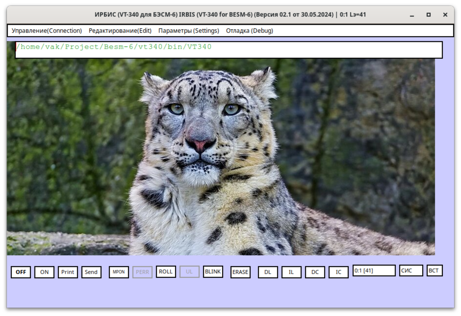

# VT-340 Terminal Emulator

A software emulator of the VT-340 display terminal, written in Object Pascal
(FreePascal / Lazarus). Designed for connecting to the BESM-6 mainframe at
`besm6.cs.msu.ru` via Telnet or SSH.

**Version:** 02.1 (30.05.2024)
**Authors:** Н.В.Макаров-Землянский, А.П.Ильин



## What Is This?

The [BESM-6](https://en.wikipedia.org/wiki/BESM-6) was a Soviet
high-performance mainframe computer. A working replica is maintained at
Moscow State University and is accessible over the internet. This program
provides a period-correct VT-340 terminal interface to that system,
including the characteristic hardware buttons (MPON, PERR, ROLL, BLINK,
ERASE, SEND, DL, IL, DC, IC) and the НВМЗ keyboard layout used with the
machine.

---

## Features

- Telnet and SSH connections
- Two display styles: *Accurate* (fixed-width screen buffer) and *Modern*
- Configurable screen size (16 lines, fixed, or fit-to-window)
- НВМЗ and Windows keyboard layouts
- Ctrl-character display modes (blink, uppercase, space)
- Server list with per-server connection profiles
- Text search in the terminal buffer
- Email (SMTP/IMAP) integration via Indy
- Password-protected startup
- Settings persisted in `Prm.ini`

---

## Building on Ubuntu

### 1. Install build dependencies

```bash
sudo apt install fpc lcl-units lcl-gtk2
```

This provides FreePascal 3.2.2 and the Lazarus LCL units (GTK2 widgetset).
The Indy networking library is checked out as the `Indy/` directory and compiled
from source automatically — no separate installation is needed.

### 2. Clone the repository

```bash
git clone <repo-url> vt340
cd vt340
```

### 3. Build

```bash
make
```

The compiler auto-detects the Lazarus paths for the standard Ubuntu/Debian
package layout. The binary is written to `bin/vt340`.

### Build variants

```bash
make DEBUG=1          # Debug build (-g -gl -dDEBUG), no optimisation

make LCLDIR=/path     # Override the LCL units directory (non-standard install)

make clean            # Delete build artefacts (obj/ and bin/)
```

### Cross-compiling to Win32

To produce a `bin/vt340.exe` from Linux you need a FreePascal cross-compiler
targeting i386-win32:

```bash
make CROSS=1 FPC=/path/to/i386-win32-fpc LCLDIR=/path/to/win32-lcl-units
```

---

## Running

```bash
./bin/vt340
```

On first launch the program creates `Prm.ini` in the working directory to
store all settings.

> **Note:** The Linux build is a native GTK2 application. Some features
> (printing, certain scroll operations) are Windows-only and are silently
> disabled on Linux.

---

## Connecting to the BESM-6

### Telnet

1. Open **Parameters → Server**.
2. Add a server: address `besm6.cs.msu.ru`, port `23`, type *Telnet*.
3. Click **Connect** (or press the MPON button).

### SSH

SSH tunneling is handled by a bundled `plink.exe` (PuTTY's command-line
client) on Windows. Configure the tunnel parameters under
**Parameters → SSH**: host, port, username, and the path to your `.ppk`
private key file. The application launches `plink.exe` as a subprocess to
create a local TCP tunnel, then connects Telnet to `localhost:<tunnel-port>`.

---

## Configuration file — `Prm.ini`

All settings are stored in INI format next to the executable.

| Section | Contents |
|---------|----------|
| `[Main]` | Window position and size |
| `[Server]` | Active connection (address, port, type, SSH parameters) |
| `[List Servers]` | Saved server profiles |
| `[Screen]` | Font, colours, keyboard layout, Ctrl-display mode, password |

Delete `Prm.ini` to reset everything to defaults.

---

## Project Structure

```
vt340.dpr               — Program entry point; creates all forms
MainCV.pas              — Global state (connection params, display settings)
WinUnix.pas             — Platform abstraction (TMemo scroll operations)
UFormMain.pas           — Main terminal window
UFormSettingsServer.pas — Server list dialog
UFormSettingSSH.pas     — SSH tunnel configuration
UFormSettingsScreen.pas — Font, colour, keyboard settings
UFormEntry.pas          — Startup password dialog
UFormSetPassword.pas    — Change password dialog
UFormSearch.pas         — Text search in terminal buffer
UFormDebug.pas          — Debug output window
UFormHelp.pas           — Help viewer (also handles email via Indy SMTP/IMAP)
UFormMessage.pas        — Generic message dialog
UFormLanguage.pas       — Language / charset selection
plink.exe               — PuTTY plink for SSH tunneling (Windows)
Prm.ini                 — Runtime settings (created on first run)
```

---

## Dependencies

| Dependency | How supplied |
|------------|-------------|
| FreePascal ≥ 3.2 | System package (`apt install fpc`) |
| Lazarus LCL (GTK2) | System package (`apt install lcl-units lcl-gtk2`) |
| Indy 10 | Checked out from Github |
| plink.exe | Bundled (Windows SSH tunneling only) |
